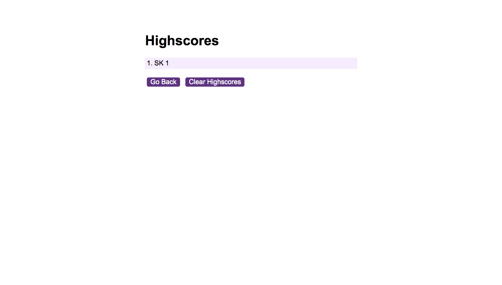
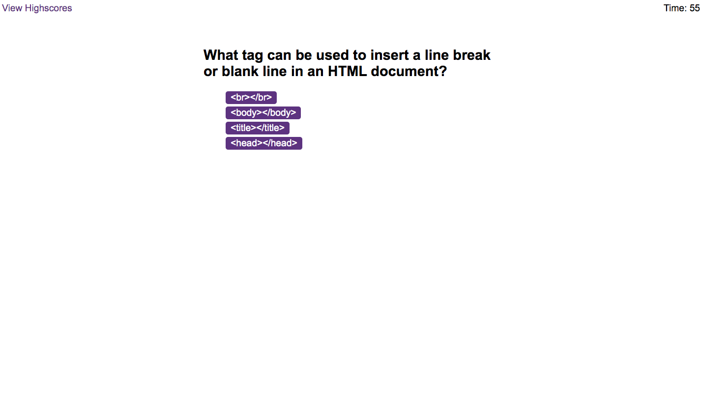

# code-quiz
## Description

This weeks challenge was to creat a code quiz. The purpose of the challenge was to build upon my current javascript knowledge and use calls such as 'queryselector' and 'eventlistener' correctly. This challenge was also the first time saving data to local storage. 

## Usage

To begin, click the start quiz button. The timer will begin to count down from 60 seconds. After the quiz has been completed, or the timer has run out, the quiz will end. A question and four possible answers will appear on the page. Once an answer is selected, the next question will appear. If the answer selected is correct, the score will increase by one. If incorrect, the timer will decrease by 5 seconds as penalty. After the quiz has been completed, the score is displayed and the page will prompt you to add your initials to save your score. After your initals have been added, the highscores table will be displayed with your score and other scores for the test that have been completed previously. 
Here are some screenshots, one of the quiz and one of the high score page for context.

Here is the link to the deployed page: https://shazzy-kawa.github.io/code-quiz/ 
Here is the link to the GitHub repository: https://github.com/shazzy-kawa/code-quiz.git

## Credits

This has been completed using the resources provided by the bootcamp as well as support during the office hours. 

